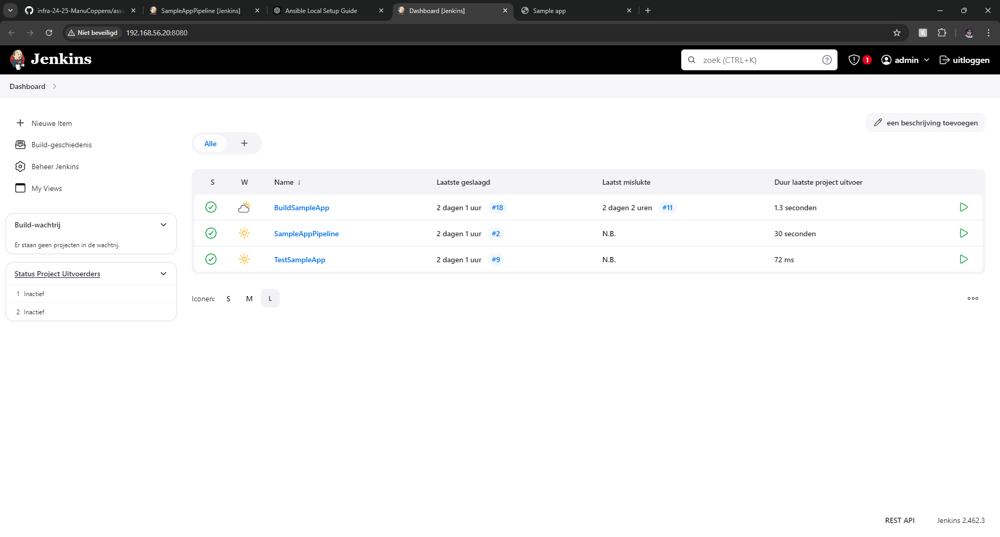
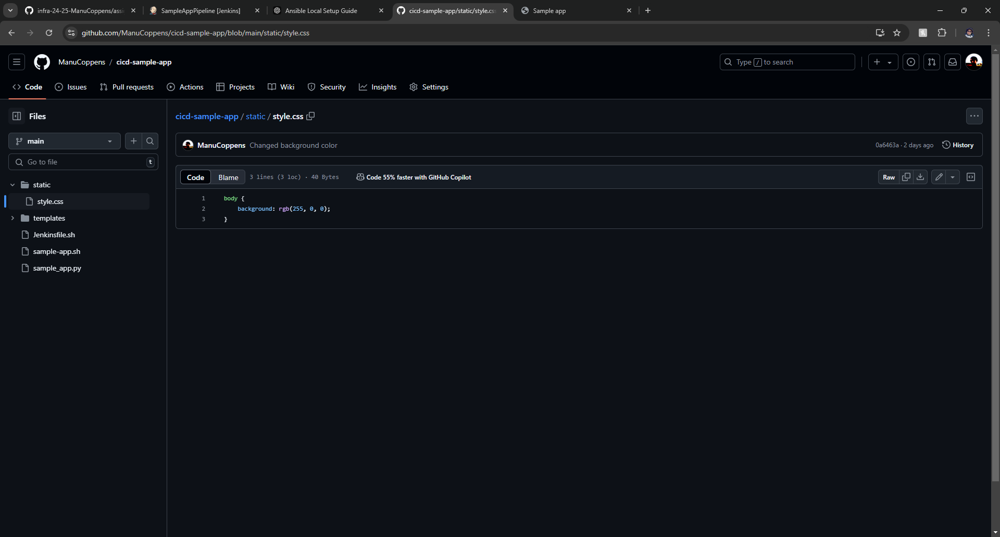
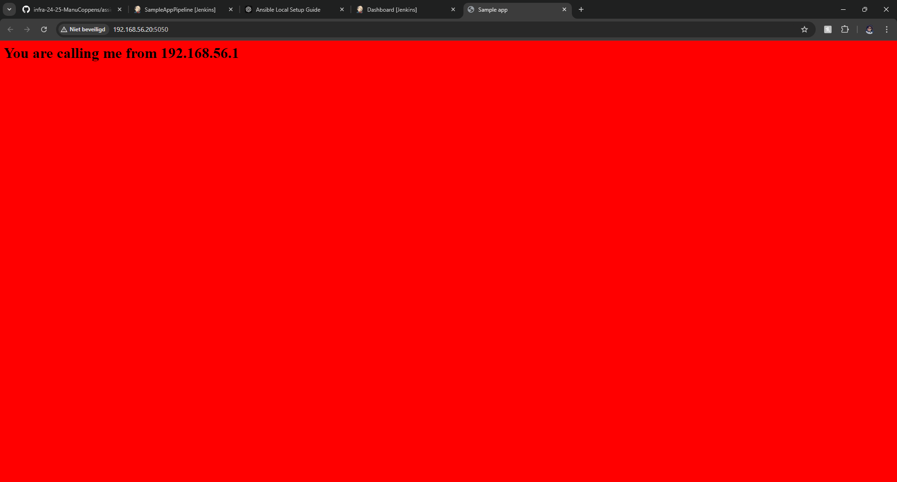

# Lab Report: 1-cicd.md

## Manu Coppens


1.1 Was niet al te moeilijk buiten de stapjes volgen.

1.2 Gewoon stappen volgen

1.3 Het passwoord dat ik had gekregen was 6a32d0421df14ee4bd8b68286f0e2ecc

1.4 Hier had ik me ingelogd en niet goed gelezen dus had ik de plugins niet gedownload, waardoor ik dus alles eerst had moeten zoeken en downloaden.

1.5 Hierbij had ik een probleem, het volgen van stappen 1 en 2 was niet moeilijk, maar in stap 3 had ik foutmeldingen, Ik had container nog nie goed afgesloenmaar en command mkdir tempdir niet werkte omdat er al een tempdir file was dus ik heb in mijn eigen github repo in de file cicd-sample-app.git de commandos mkdir tempdir in commentaar gezt waardoor ik geen probleem meer had.

1.6 Het was een beetje zoeken welke Ip's ik moest zoeken maar dat is uiteindelijk met een beetje proberen gelukt.

1.7 de pipeline toonde niks van problemen.



1.8 had me zeer blij gemaakt want ik had in de style files de kleur veranderd en gepushed en het was veranderd waardoor dit labo dus gelukt is. 	



---
Fouten dat ik had + oplossingen:  
---
fout 1 : buildapp, een docker container was al gepakt: 
```
docker stop ${dockerID}
docker rm ${dockerID}
```
dan de buildapp opnieuw gerunned en fout was opgelost.

```
---
## Resources


I didn't use resources.

commandos dat ik belnagrijk vond 
-- kijken welke containers er runnen
docker ps 

-- containder stoppen en verwijderen
docker stop samplerunning
docker rm samplerunning

-- container opstarten
docker start jenkins_server

--container details
docker inspect samplerunning
beter voor ip
docker inspect -f '{{range .NetworkSettings.Networks}}{{.IPAddress}}{{end}}' samplerunning

--ww
hogent242526
27d488b540344ca0a74458eec56fc51b

url naar jenk
http://192.168.56.20:8080/

url sample running
http://192.168.56.20:5050/